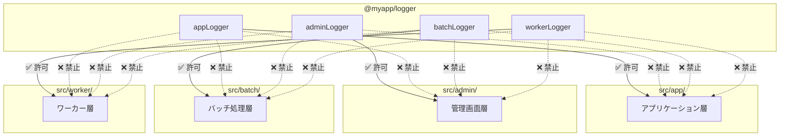
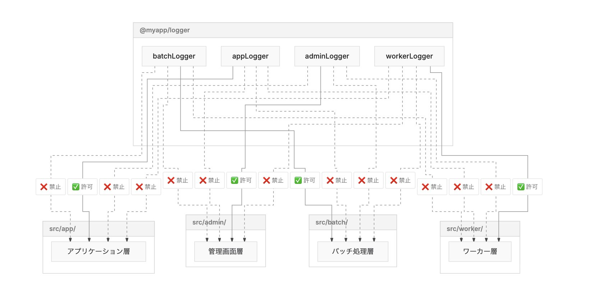

**⚠️このリポジトリは[lukilabs/beautiful-mermaid](https://github.com/lukilabs/beautiful-mermaid)のforkです。StarやSponsorなどは本家リポジトリの方へお願いいたします。⚠️**

詳細が気になる人は[ブログ](https://blog.inorinrinrin.com/entry/2026/02/26/113056)を読んでください。

# このリポジトリの存在意義

`browser.ts`をはてなブログ等、Webアプリケーションから部分的に利用するにあたりCDNにビルドしたjsを配信するために存在しています。

# はてなブログでの利用方法

以下を 「詳細設定 > <head>要素にメタデータを追加」 に追加してください。

```html
<script type="module" src="https://cdn.jsdelivr.net/gh/ysknsid25/beautiful-mermaid@main/dist/beautiful-mermaid.browser.min.js"></script>
```

あとはブログ記事内で以下のようにMermaid記法の文章を埋め込むだけです。

```



これは以下のように表示されます。



あとはCSS等を使って、親要素に対する`width`等を設定してあげればOKです。
